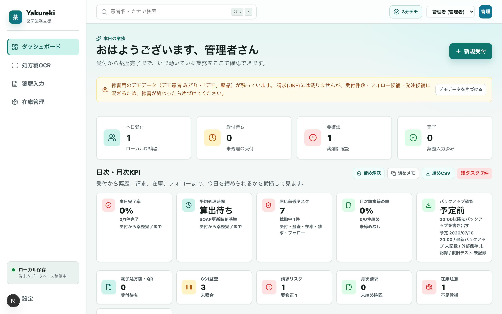
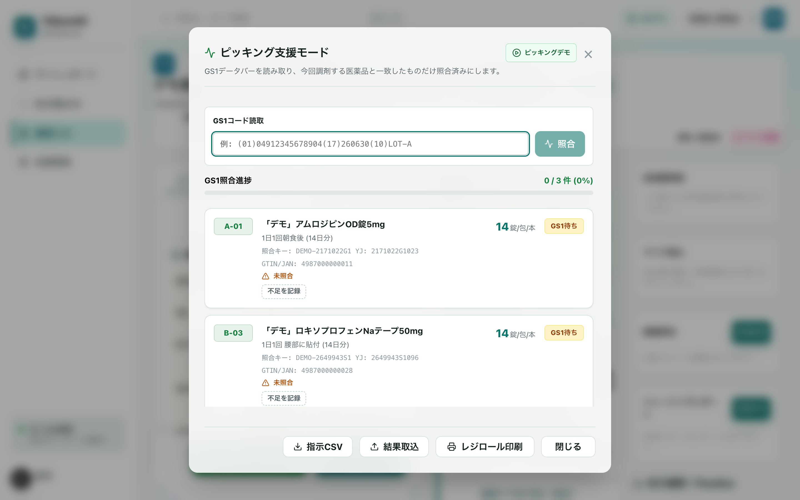
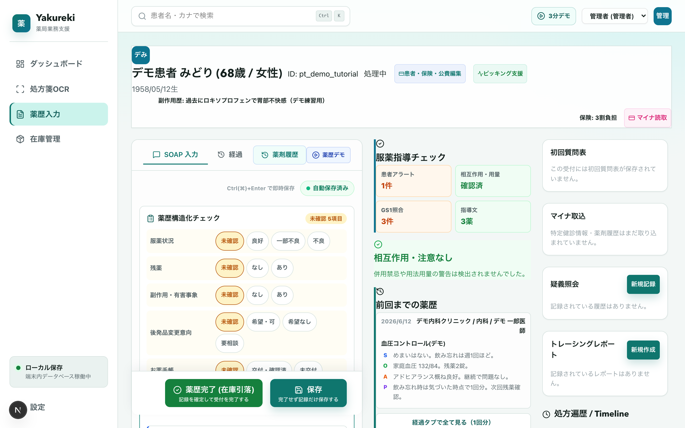
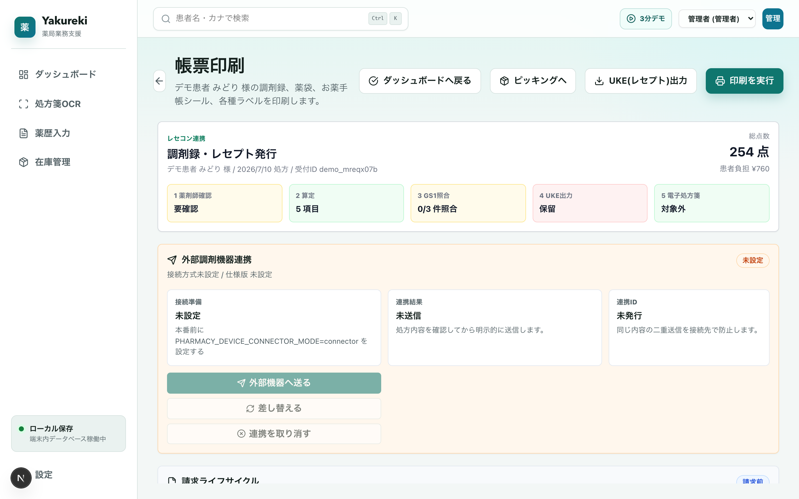

# pharma-oss — Pharmacy OS

**薬局業務をこれ1つで。ローカルファーストの調剤薬局向け電子薬歴・レセプト（UKE）システム**

A local-first pharmacy EMR & dispensing-receipt (UKE) system for Japanese community pharmacies, built with Next.js and RxDB. Prescription intake (OCR / QR / e-prescription), GS1-verified picking, SOAP medication records with AI-drafts, R8 (2026) fee calculation, UKE export, inventory with lot/expiry tracking, tamper-evident audit logs, and encrypted offline-capable local storage — no server required.

[](LICENSE)
[](docs/developer_manual.md)
[](#contributing)



## ⚠️ Disclaimer / 免責事項

This software is **not** a certified medical device and **not** an officially
certified receipt-computer (レセプトコンピュータ) system under Japanese
regulation. It is provided "AS IS", without warranty of any kind, under the
Apache License 2.0 (see [LICENSE](LICENSE)) — see §7–8 of that license for
the full disclaimer of warranty and limitation of liability.

Anyone deploying this for real patient care or real insurance billing is
solely responsible for independently verifying claim logic, drug master
data, and generated documents against current official sources (厚生労働省
告示・通知、支払基金仕様、審査支払機関の運用) before using it in production.
AI-assisted suggestions in this app (SOAP drafts, risk flags, etc.) are
candidate proposals only; the pharmacist is responsible for every clinical
and billing decision — see "設定 > レセプト点検" for implementation status
and known gaps, and [docs/user_manual.md](docs/user_manual.md) for the
AI-assist scope and safeguards.

本ソフトウェアは、認証された医療機器およびレセプトコンピュータではありません。無保証で提供されます（詳細はApache License 2.0本文を参照）。実際の患者対応・保険請求に用いる場合は、算定ロジック・医薬品マスタ・生成帳票を最新の公式資料と必ず突合し、利用者自身の責任で検証してください。AI補助は候補提示に過ぎず、臨床・請求の最終判断は薬剤師が行います。

## なぜ pharma-oss か

- **ローカルファースト** — 患者データは各端末のブラウザ内DB（IndexedDB）に暗号化保存。サーバー不要、月額課金なし、ネットが切れても業務は止まりません。PWAとしてインストールできます。
- **受付から請求までひと続き** — 処方箋の読み取り→ピッキング→監査→薬歴→帳票印刷→レセプト（UKE）出力まで、1つの画面フローでつながります。未完了の確認事項があれば先に進めない安全設計です。
- **現場の安全装置** — GS1バーコード現物照合、アレルギー/副作用歴・相互作用・重複投薬チェック、ハッシュチェーン監査ログ、請求前チェックによるUKE出力停止。「うっかり」を仕組みで防ぎます。
- **AI補助は候補提示に徹する** — SOAP下書きやリスク候補は根拠付きで提示し、採否は必ず薬剤師が判断。採否は監査ログに残り、店舗ごとに標準/制限/停止を選べます。

## 主な機能

### 受付
- **処方箋OCR** — ブラウザ内OCR（Tesseract.js）で画像から患者・処方を下書き入力し、原本と並べて確認
- **処方箋QR / 電子処方箋** — JAHIS QR取込、電子処方箋の取得・署名/重複投薬チェック確認後の反映
- **手入力受付と名寄せ** — 氏名＋生年月日で既存患者へ自動紐付け。同姓同名は統合確認へ

### 調剤・ピッキング
- **棚番地順ピッキングリスト** と **GS1データバー現物照合**（薬品・ロット・使用期限の一致確認）
- **不足のその場記録** — 棚不足は発注ワークベンチの候補へ自動連動
- **既存ピッキングシステム連携** — 指示CSV（棚番地・JAN・必要量・ロット候補入り）書き出しと、結果CSV/TSV取込（完了→照合済み、不足→不足記録）
- **NSIPS準拠の調剤機器・POS連携** — 施設内コネクタ経由の送信・差替・取消



### 薬歴（電子薬歴）
- **4パネルSOAPエディタ** ＋ 服薬状況・残薬・副作用などの**構造化チェック**
- **前回Do・処方差分・薬歴タイムライン** — 前回来局との違いを見落としにくく
- **安全チェック** — 患者アレルギー/副作用歴との突合（一般名ベースのファジー一致）、PMDA添付文書由来の相互作用・禁忌警告、同効薬重複検知
- **AI補助SOAP下書き** — 処方・アラートを根拠に候補を提示。反映は薬剤師確認として記録



### 算定・レセプト
- **令和8年（2026年）調剤報酬ベースの自動算定** — 薬剤調製料、調剤管理料、服薬管理指導料、各種加算。算定OFF理由の記録つき
- **請求前チェック** — 廃止薬・薬価未設定・レセ電コード欠落・UKE必須レコード/並び順/合計点数を検査し、問題があれば出力を停止
- **UKE出力（Shift-JIS）** — 単票・月次一括。請求スナップショットと差分表示、返戻修正メモ、月次請求ワークベンチ（受付済一括締め・再請求）



### 帳票
- 調剤録、レセプト（調剤明細・領収証）、薬袋、薬情（薬情テンプレは薬剤師承認制）、お薬手帳シール、水剤・軟膏ラベル、レジロールピッキングリスト。余白・フォントは端末ごとに調整可

### 在庫
- ロット・使用期限単位の在庫、入庫登録（GS1/JAN）、発注ワークベンチ（患者名を含まない発注CSV）、分譲（店舗間移動）、デッドストック検知、棚番地管理

### 運用・ガバナンス
- **監査ログ** — 主要操作をハッシュチェーン署名付きで記録（複数端末では端末別チェーン）。整合性検証、JSON書き出し、S3 Object Lock（WORM）保全ジョブ
- **バックアップ/復旧** — パスワード暗号化JSON、世代管理、復旧前差分プレビュー、閉店時バックアップ予定、OSスケジューラ用の自動書き出し/外部保存ジョブ
- **サテライト端末同期（複数端末）** — メイン端末に患者データを集約し、サテライト端末はメモリのみ（ディスク保存なし）。メイン停止中も入力継続＋未同期警告、再接続で自動送信。競合はハブ優先＋薬剤師レビュー。端末の追加・廃棄はトークン発行・失効のみ（[docs/satellite_terminal_sync_plan.md](docs/satellite_terminal_sync_plan.md)）
- **権限とスタッフ管理** — 管理者/薬剤師/事務のロール制御、パスキー対応、退職・端末移行の復旧手順
- **日次締め・KPI** — 完了率、処理時間、返戻、在庫不足、フォロー候補を横断表示。月次レビューとCSV/BI出力
- **データ品質ツール** — 患者重複（名寄せ）・薬品マスタ重複の検出と安全な統合、医薬品マスタの公式CSV/ZIP更新（差分CSV＋ロールバックJSON自動生成）

## 3分で試す

```bash
npm install
npm run dev
# → http://localhost:3000
```

1. 初回起動で管理者パスワードを設定
2. 右上の「**3分デモ**」を開き、最後のステップで「**デモ患者で体験を始める**」
3. 架空のデモ患者（副作用歴アラート・前回薬歴・在庫ロット付き）で、受付→ピッキング（GS1照合・不足記録）→薬歴→帳票までを実際の画面で練習できます

デモデータは請求（UKE）に混入しない設計で、ダッシュボードの「デモデータを片づける」からいつでも一括削除できます。

## アーキテクチャ

| レイヤ | 技術 |
|---|---|
| フロントエンド | Next.js (App Router) / React / TypeScript |
| ローカルDB | RxDB + Dexie (IndexedDB)、`encryption-crypto-js` による暗号化 |
| 参照マスタ | SQLite WASM/OPFS（薬品検索・用法コード） |
| OCR / バーコード | Tesseract.js（日本語）/ @zxing（GS1・QR） |
| 帳票 | ブラウザ印刷（CSSレイアウト、実紙検証手順つき） |
| テスト | node:test + tsx（ユニット 1,150+）、Puppeteer（E2E・印刷回帰） |

サーバーサイドの患者データ保存は既定ではありません（単独端末運用）。バックエンドAPIは開発用ユーティリティ（公式PDF照合など）のみです。店舗内で複数端末を使う場合のみ、メイン端末のNext.jsサーバー内（`node:sqlite`・AES-256-GCM暗号化）に正本を集約し、サテライト端末は患者データを端末に保存しません（`PHARMACY_SYNC_ROLE`、詳細は [docs/satellite_terminal_sync_plan.md](docs/satellite_terminal_sync_plan.md)）。

**本番運用の必須設定**: `NEXT_PUBLIC_DB_PASSWORD` を長いランダム値に設定してください（[.env.example](.env.example)）。未設定時はインストールごとにランダム鍵を生成しますが、明示設定を推奨します。

## 同梱データについて

`src/lib/data/` の医薬品マスター（支払基金由来）とPMDA添付文書由来の相互作用・禁忌データは、公的機関の公開情報から生成したスナップショットです。出所・利用条件・鮮度の注意は [NOTICE](NOTICE) を参照してください。実運用前にはアプリ内「設定 > マスタ更新」で最新の公式マスターへ更新してください。

## ドキュメント

- [現場運用マニュアル](docs/field_operation_manual.md) — 開局前・受付〜完了・閉局時・月次・デモ練習・トラブル対応
- [取扱説明書](docs/user_manual.md) — 全機能の詳細（バックアップ、監査ログ保全、マスタ更新、外部連携など）
- [開発者マニュアル](docs/developer_manual.md) — 開発・テスト・E2E・スクリーンショット回帰
- [operational_issues.md](operational_issues.md) — 実運用に向けた課題と解決状況の一覧（正直に全部書いてあります）

## Production Notes

- 本番初回起動時にスタッフが未登録の場合のみ、初回セットアップモードでログインを回避できます。スタッフを1人以上登録すると、以後はスタッフログインが必要です。
- データベース初期化に失敗しても、患者データ保護のため自動削除は実行しません。バックアップ確認後に管理者の復旧手順で対応してください。
- 電子レセプト/UKE出力は、公式仕様との突合と返戻ケースの検証が完了するまで実請求に使用しないでください。
- 患者データはブラウザのローカルDB（IndexedDB）にのみ保存されます。バックアップ・外部保全・監査ログの手順は [docs/user_manual.md](docs/user_manual.md) を参照してください。

## Contributing

Issue・Pull Request歓迎です。開発環境のセットアップとテスト実行は [docs/developer_manual.md](docs/developer_manual.md) を参照してください。

```bash
npm run lint
npx tsc --noEmit
npx tsx --test $(find src -name "*.test.ts")
```

脆弱性の報告は公開Issueではなく [SECURITY.md](SECURITY.md) の手順でお願いします。

## License

Licensed under the [Apache License, Version 2.0](LICENSE).

Bundled reference data (medicine master, package-insert derived interaction/label data) is redistributed under separate terms — see [NOTICE](NOTICE) for attribution and source details.

---

© 2026 pharma-oss Project Contributors
