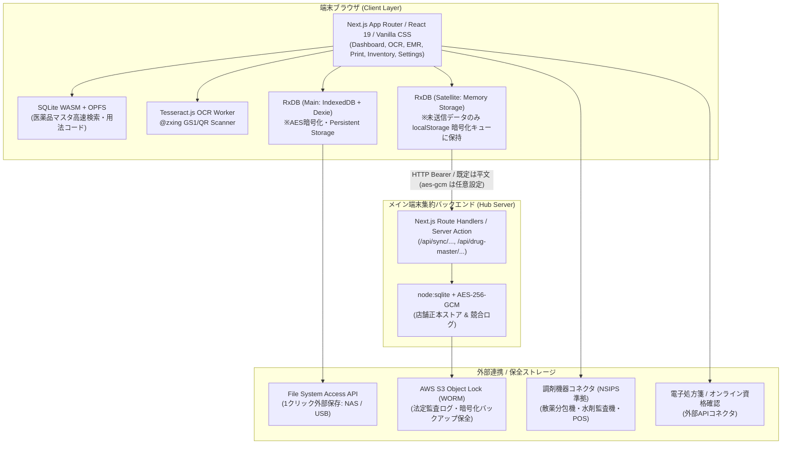
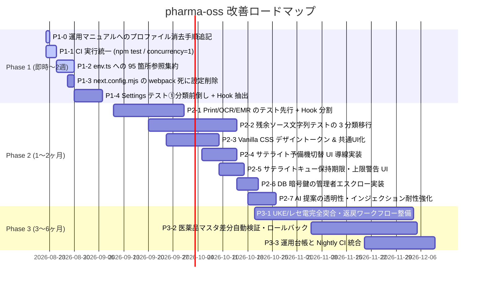

# 【技術提案・改善計画書（第3版・承認版）】pharma-oss システム構成分析と実運用に向けた段階的改善計画

- **提出先**: Claude 統括技術リード（上司）
- **起案者**: Antigravity 開発ペア
- **起案日**: 2026-08-22（初版起案）、2026-08-22（第2版改訂）、2026-08-22（第3版改訂: Phase 1 条件付き承認反映）
- **対象バージョン**: pharma-oss v1.0.0 (コミット `0d587bb` + 未コミット変更 29 ファイル)
- **判定**: **Phase 1 承認（条件付き）** → 着手条件 3 点（N-1, N-2, 訂正 1）反映完了
- **検証規約**: `honest-verification`（実測値準拠、嘘・偽カバレッジの排除、ドメイン仕様遵守）

---

## 1. エグゼクティブサマリ

### 1.1 背景とミッション
`pharma-oss` は、日本の保険調剤薬局向けに開発されている **完全無料・オープンソースの「ローカルファースト調剤薬局OS（電子薬歴・レセプト・在庫・監査ログ）」** です。
サーバー維持費やクラウド利用料を不要とし、ブラウザ内データベース（RxDB + IndexedDB）および暗号化同期（ハブ・サテライト構成）によって、オフラインでも止まらない業務基盤を提供します。

一方で、調剤報酬請求（令和8年改定対応）、UKE（レセプト電算データ）出力、医薬品マスタ、医療安全（アレルギー・相互作用・重複投薬検知）、患者の要配慮個人情報保護といった **極めて高い正確性と安全性が求められる医療ドメイン** を担っています。

### 1.2 本計画書の目的と改訂経緯
- **初版起案（2026-08-22）**: 現状分析と Phase 1〜3 の改善計画を起案。
- **第1巡レビュー（判定: 差し戻し）**: 実機検証に基づき、テスト全通過の実態（1,331件）、既存 CI キャッシュ構成、`env.ts` 実態、サテライト暗号化キューの localStorage 実装との齟齬を指摘され、8 項目の差し戻し条件を是正。
- **第2巡レビュー（判定: Phase 1 承認）**: 差し戻し条件全対応を確認の上、**「P1-4 の安全網確保（設定画面のテスト①分類前倒し）」「図のエッジラベル実態化」「assert 数内訳の適正化」** の 3 点を着手条件として提示。
- **第3版（本書）**: 上記着手条件 3 点および論点 1 のリード判断（(c)必須・(b)Phase 2採用・(a)不採用）を完全反映した **実行確定版** です。

---

## 2. システム構成・現状の実測分析 (Fact Base)

### 2.1 品質ゲート・メトリクス実測値（2026-08-22 実測）

> [!NOTE]
> **検証環境**: HEAD = `0d587bb` / macOS (darwin 25.5.0) / Node 22 / TZ=Asia/Tokyo
> **作業ツリー注記**: 実測時、作業ツリー内に未コミット変更 29 ファイルが存在（型検査・テストはすべてこの状態で検証）。

| 項目 | 検証コマンド | 実測結果 | 判定 | 備考 |
|---|---|---|:---:|---|
| **型検査** | `npx tsc --noEmit` | **エラー 0 件** (exit 0) | ✅ PASS | 型定義の不整合なし |
| **Lint** | `npm run lint` | **エラー 0 件 / 警告 2 件** | ⚠️ WARN | `src/app/emr/page.tsx:1769` と `:3179` の `@next/next/no-img-element` |
| **本番ビルド** | `npm run build` | **成功** (exit 0) | ✅ PASS | static pages 27 件を prerender / ルート総数 29 (Turbopack 最適化ビルド) |
| **ユニット/統合テスト** | `npm test` | **1,331 件中 1,331 pass / 0 fail** (exit 0) | ✅ PASS | 所要時間: 57.5s (`--test-concurrency=1`) |
| **コードベース規模** | `src/` 配下 TS/TSX | **416 ファイル / 148,889 行** | - | `src/` 全体では 426 ファイル（JSON/SVG等含む） |
| **スクリプト規模** | `scripts/` ディレクトリ | **37 ファイル** | - | `package.json` の npm scripts は 44 件 |

```
【主要ページコンポーネントの行数実測】
  5,680 行  src/app/settings/page.tsx       (8タブ分割後も依然大 / 124 useState, 312 props)
  7,091 行  src/app/print/[visitId]/page.tsx (帳票印刷)
  6,052 行  src/app/ocr/page.tsx             (処方箋OCR/受付)
  4,340 行  src/app/emr/page.tsx             (電子薬歴/SOAP)
  4,360 行  src/app/inventory/page.tsx       (在庫管理/分譲)
  1,958 行  src/app/page.tsx                 (ダッシュボード)
-----------------------------------------------------------
 29,481 行  (主要 6 画面だけで約 3 万行)
```

```
【テストコードの質的実測】
- 全テストファイル: 188 ファイル
- readFileSync による「ソース文字列正規表現テスト」: 65 ファイル (65 / 188 = 34.57%)
- assert.match / assert.doesNotMatch 箇所: 全体 2,843 箇所
  （内訳: 65 のソース文字列テストファイル内 2,267 箇所 / 通常テスト 123 ファイル内 576 箇所）
```

---

> [!NOTE]
> **2026-08-26 時点の実測（Phase 1・Phase 2 完了後）**
>
> ```
> npm test        1,360 pass / 0 fail   (着手時 1,331)
> tsc --noEmit    エラー 0 件
> npm run build   成功 (28/28 static pages)
>
> 主要 6 画面     29,481 行 → 9,498 行  (-67.8%)
>   print   7,091 → 1,796    ocr      6,052 → 3,170
>   emr     4,340 → 2,320    settings 5,680 →   793
>   inventory 4,360 → 866    dashboard 1,958 →  553
>
> インライン style={{}}          939 → 3 箇所（動的CSS変数の正当な用途のみ）
> ソースを readFileSync するテスト  50 → 23 ファイル
>   （残り 23 は運用CLI系 22 + 合意済み例外 PrintLayoutRegression）
> ```

### 2.2 アーキテクチャ構成図（実態準拠）



---

### 2.3 これまでの改善実績と定着状況
1. **セキュリティ依存関係の解消 (C-1)**: `rxdb` を `17.4.0` へ更新し、`ws` 起因の High 脆弱性 5 件を解消。
2. **検証スクリプトの配備 (B-3)**: `npm test`（`TZ=Asia/Tokyo` 固定、`--test-concurrency=1`）、`npm run typecheck`、`npm run verify` を配備。
3. **設定画面のタブ分割 (B-1)**: `src/components/settings/` に 8 タブコンポーネントを切り出し（10,020 行 → 5,680 行）。ただし 124 の `useState` は本体に残存（312 props 境界が増加）。
4. **サテライト端末の未送信キュー (A-1)**: `src/lib/sync/satellite_local_queue.ts` により、未送信データを localStorage に保持し ACK 時に削除する仕組みを実装済み。
5. **外部保存の 1 クリック化 (A-2)**: `src/lib/file_system_backup.ts` を新設し、Chromium File System Access API による外部保存＋SHA-256 読み戻し照合を実装済み。
6. **環境変数モジュールの新設 (B-6)**: `src/lib/env.ts` を新設（ただし 95 箇所の直接参照が残存）。
7. **CI キャッシュとジョブ分割 (B-4)**: `.github/workflows/onboarding-e2e.yml` は既に `static` と `onboarding-e2e` の 2 ジョブに分割され、npm・`.next/cache`・Puppeteer の 3 重キャッシュを設定済み。

---

## 3. 現状の課題とボトルネック分析（4つの視点）

### 3.1 【視点 A: 臨床安全・法規・レセプト請求】（最重要）

> [!IMPORTANT]
> 医療データと保険請求に関わるロジックは、いかなるリファクタリングにおいても「機能後退」や「暗黙の仕様改変」が許されません。

1. **レセプト電算（UKE）仕様との完全突合・返戻ワークフロー**:
   - RE/HO/KO/IY/TO 等の基本レコード出力とバリデーションを実装済みだが、公費併用（難病・自立支援・マル乳・マル子等）、高額療養費、減免区分、返戻（査定）時の修正・再請求履歴管理の公式仕様突合が一部未達。
2. **医薬品マスタおよび医療機関マスタの公式更新パイプライン**:
   - 支払基金の最新マスターCSV/ZIP取得、地方厚生局の医療機関XLSX取り込みに対応したが、薬価改定・経過措置品目・代替薬マッピングの自動検知とロールバック安全弁のさらなる強化が必要。
3. **AI提案（SOAP下書き・リスク候補提示）の透明性と薬剤師承認記録**:
   - AIドラフトの採否が監査ログに残る設計となっているが、プロンプトインジェクション耐性や根拠法令・添付文書の明示性をより強固にする余地がある。

---

### 3.2 【視点 B: データ保全・可用性・ローカルファースト】

1. **サテライト端末ローカルキューの運用統制とハードリミット**:
   - `src/lib/sync/satellite_local_queue.ts` において、未送信キューが localStorage に保持され、暗号鍵も同じ localStorage に平文で同居している。
   - リード判断に基づき現行モデルを許容するが、**「端末廃棄・返却時のブラウザプロファイル消去手順の必須化（即時）」** および **「キュー保持期間（当日閉局まで）・件数のハードリミットと警告UI（Phase 2）」** の適用が必要。
2. **DB 暗号鍵の管理リスク**:
   - `src/db/index.ts:62-98` の通り、`NEXT_PUBLIC_DB_PASSWORD` 未設定時のローカルランダム鍵が localStorage (`pharmacy_os_local_db_password`) に平文保存されるため、ブラウザプロファイル破損時に復号不能となる。管理者パスワードでラップした鍵エスクローが必要。
3. **メイン端末（Hub）障害時リカバリの迅速化**:
   - サテライト端末はハブが起動していないとログインできず、ハブ故障時の予備機切り替えが環境変数 `.env` の変更と再起動を要する。UI からの動的切り替え導線が求められる。

---

### 3.3 【視点 C: フロントエンド構造・UI/UX・デザインシステム】

1. **ページコンポーネントの状態肥大化とリファクタリング順序（N-1）**:
   - `settings/page.tsx` (5,680行 / 124 useState, 312 props), `print/[visitId]/page.tsx` (7,091行), `ocr/page.tsx` (6,052行), `emr/page.tsx` (4,340行), `inventory/page.tsx` (4,360行)。
   - 設定画面を覆うテストは 10 ファイル / 623 assert がすべてソース文字列正規表現テストであり、**挙動の安全網がないまま Hook 切り出しを行うと 623 assert が壊れて安全性が検証不能となる**。
   - したがって、**「設定画面のテスト①分類（純粋関数抽出＋本物テスト作成）を Hook 抽出の直前に前倒し」** して同一コミットで閉じる安全網の構築が不可欠。
2. **ビルド設定の死に設定削除**:
   - Next.js 16.2.3 は Turbopack が既定であり（`.next/turbopack` 生成を確認済み）、`next.config.mjs` の `webpack:` ブロック内 `config.resolve.fallback` は無効化されているため削除する。
3. **Vanilla CSS デザイントークンの集約**:
   - `src/app/globals.css` へのカラーパレット・スペーシング・共通 UI プリミティブ（Button, Badge, Modal, Card）の集約。

---

### 3.4 【視点 D: 開発効率・テスト品質・CI/CD】

1. **ソース文字列正規表現テスト（65 ファイル / 2,267 箇所）の 3 分類移行**:
   - `readFileSync('page.tsx')` によるテストを、①純粋関数直接テスト、②UI定数突合、③形骸化テストの削除、の 3 分類で整理。
2. **CI とローカルのテスト実行条件の乖離解消**:
   - `.github/workflows/onboarding-e2e.yml` の単体テスト実行で欠落している `--test-concurrency=1` を補正し、`npm test` 呼び出しに統一。
3. **環境変数参照の集約（95 箇所）**:
   - `src/` 配下の 95 箇所の直接 `process.env.` 参照を既存の `src/lib/env.ts` へ移送。
4. **レビュー用スクリプト（37 ファイル / 44 npm scripts）の運用台帳化**:
   - 手動実行が必要な CLI スクリプトの運用台帳化と Nightly CI 統合。

---

## 4. 段階的改善計画（ロードマップと優先度）



---

### 4.1 Phase 1: 開発基盤の整合と即効性の高い改善（即時〜2週間 / 承認済み）

| タスク ID | 改善項目 | 目的・内容 | 工数 (人日) | 期間 (暦日) |
|---|---|---|:---:|:---:|
| **P1-0** | **運用マニュアルへのプロファイル消去手順追記** | `docs/field_operation_manual.md` に、サテライト端末の廃棄・返却・貸与・修理出しの際にブラウザプロファイル消去を必須とする運用手順を追記 | 0.2 人日 | 1 日 |
| **P1-1** | **CI テスト実行条件の統一** | `.github/workflows/onboarding-e2e.yml` の単体テスト実行を `npm test`（`--test-concurrency=1` 付き）に統一し、CI/ローカル間の並列度乖離による flake を根絶する。E2E の matrix 並列化を導入 | 1 人日 | 3 日 |
| **P1-2** | **`env.ts` への 95 箇所参照集約** | `src/` 配下の直接 `process.env.` 参照（95 箇所）を既存の `src/lib/env.ts` 経由へ移送し、docstring の主張と実態を一致させる | 3 人日 | 5 日 |
| **P1-3** | **`next.config.mjs` の死に設定削除** | Turbopack ビルド下で無効化されている `webpack:` ブロック（`resolve.fallback = { fs: false, path: false }`）を削除 | 0.5 人日 | 2 日 |
| **P1-4** | **Settings テスト①分類前倒し ＋ Hook 抽出** | 設定画面関連の 10 ファイル / 623 assert（実スコープ約 583、うち `SettingsAudit.test.ts` 351）を対象に、**純粋関数の抽出 ＋ 直接 import テストの作成を先行実施**。同一コミットで 124 の `useState` をカスタム Hook（`useAuditSettings()`, `useBackupSettings()` 等）へ切り出し、対応するソース文字列 assert を削除。本体を 1,000〜1,500 行程度へスリム化 | **5.5 人日**<br>*(前倒し分含む)* | **8 日** |

---

### 4.2 Phase 2: UI構造刷新と真のテスト品質確立 — **完了（2026-08-26）**

> [!NOTE]
> P2-1 〜 P2-7 および追加した P2-1.5（在庫・ダッシュボード分割）はすべて完了し、
> 各タスクで `npx tsc --noEmit` / `npm run build` / `npm test` と実描画キャプチャによる検証を実施済み。
> 完了時点の実測: **`npm test` 1,360 pass / 0 fail**、インライン `style={{}}` **939 → 3 箇所**、
> ソース文字列テスト対象 **29 ファイル → 2 ファイル**（合意済みの例外のみ）。
>
> P2-7 の実施中に、キャプチャ検証を通じて実装バグ 2 件を検出・修正した。
> いずれも UI 上は正常に見えるため、画面を実際に描画しなければ発見できなかったもの:
> - `SoapEditor.approveEntry`: `setProblems` の updater 内で代入した変数を直後に参照しており、
>   React の遅延実行により常に `null`。承認の監査ログが記録されていなかった
> - `useAuditSettings`: `filterUser` の初期値 `'all'` が自由入力欄に入り、
>   `log.userName.includes('all')` が評価されて監査ログ表が常に空だった

| タスク ID | 改善項目 | 目的・内容 | 工数 (人日) | 期間 (暦日) |
|---|---|---|:---:|:---:|
| **P2-1** | **巨大画面のモジュール分割（テスト先行 ＋ Hook 抽出）** | 画面ごとに「テスト①分類作成 → Hook 抽出 → JSX 分割」の順で閉じる：<br>・`print/[visitId]/page.tsx` (7k行) → `usePrintState` ＋ 帳票別コンポーネント<br>・`ocr/page.tsx` (6k行) → `useOcrState` ＋ 受付・突合コンポーネント<br>・`emr/page.tsx` (4.3k行) → `useEmrState` ＋ SOAP・監査コンポーネント | 8 人日 | 20 日 |
| **P2-2** | **残余ソース文字列テストの 3 分類移行** | 残る `readFileSync` テスト（約 1,644 assert）を 3 分類で整理：<br>① 純粋関数 → 関数抽出して直接 import テスト<br>② UI 文言確認 → 定数モジュールへ切り出して突合<br>③ 形骸化テスト → **削除**（テスト総数減少を許容） | 8 人日 | 25 日 |
| **P2-3** | **Vanilla CSS デザイントークン体系化** | `src/app/globals.css` にカラーシステム、タイポグラフィ、エレベーション、間白をCSS変数として整理。共通 UI コンポーネント（Button, Badge, Modal, Card）の整備 | 5 人日 | 15 日 |
| **P2-4** | **サテライト端末オフラインログイン・予備機切替** | 直近成功したスタッフPBKDF2ハッシュの短期キャッシュによるハブ未起動時ログイン許可。設定画面からのハブ接続先動的切り替え UI | 4 人日 | 10 日 |
| **P2-5** | **サテライトキュー保持期限・上限警告 UI (論点 1-b)** | 未送信ローカルキューに保持期限（当日閉局まで）および最大件数の上限を設け、超過時に明示的な警告 UI を表示して放置を検知・防止する | 2 人日 | 7 日 |
| **P2-6** | **DB 暗号鍵の管理者エスクロー実装 (§3.2-2)** | `NEXT_PUBLIC_DB_PASSWORD` 未設定時のローカル生成鍵を、管理者パスワードで暗号化してバックアップJSONへ同梱・印刷出力する鍵エスクローを実装し、プロファイル破損時のデータ全損を防止する | 2.5 人日 | 6 日 |
| **P2-7** | **AI 提案の透明性・プロンプト耐性強化 (§3.1-3)** | SOAP 下書き・リスク提示におけるプロンプトインジェクション防御、根拠法令・添付文書情報の明示的構造化、および薬剤師承認ログの監査証跡強化 | 3 人日 | 8 日 |

---

### 4.3 Phase 3: レセプト・マスタの堅牢化と本番運用体制

> [!IMPORTANT]
> **2026-08-26 実測により、当初の Phase 3 の前提が実態と食い違っていることが判明した。**
> 見積もり（P3-1 15 人日 / P3-2 7 人日）は、既に実装済みの範囲を未実装として数えていた。
> 下表は実測に基づいて残スコープを絞り込んだもの。

#### P3-3 運用台帳と Nightly CI 統合 — **完了（2026-08-26）**

| 成果物 | 内容 |
|---|---|
| `docs/ops_review_ledger.md` | 運用・レビュー CLI 24 本を Tier 1〜4 の依存グラフに整理。終了コードの意味を明記 |
| `.github/workflows/nightly-ops-review.yml` | JST 03:00 に Tier 順でドライラン。`continue-on-error` で運用レビューの未達では CI を落とさない |
| `scripts/summarizeOpsReviews.mjs` | `artifacts/` から status を集約して job summary に出力 |

実測で判明した重要事項:

- これらの CLI は **「レビュー結果が合格でないとき exit 1」** を返す設計。まっさらな作業ツリーでは 11 本すべて exit 1 になる（`release:readiness` = `blocked` / 7 ゲート未達）。**CI をこの exit code で赤にしてはならない。**
- 外部サービスへ実送信する 7 本（S3 WORM・外部転送・Webhook・PMDA 取得）は Nightly 対象外。

#### P3-1 UKE/レセ電の残スコープ — **仕様確定待ち**

当初「支払基金・国保連仕様の全レコード（CZ/KI 含む）が未達」としていたが、**実測では 10 種すべてが生成コード内で実使用されている。**

```
実装済みレコード種別: RE HO KO IY TO CZ KI GO MF SN （全 10 種）
公費併用: 56 箇所で実装済み
```

実際に残っているのは以下の 3 点のみ。

| 項目 | 実測 | 状態 |
|---|---|---|
| 高額療養費 | 参照 **0 箇所** | **未実装** |
| 返戻ワークフロー | `claim_return_manager.ts` 88 行 / 関数 2 本 / テスト 2 件 | **極端に薄い** |
| 減免区分 | 参照 9 箇所 | 部分的 |

#### P3-2 医薬品マスタ差分検証 — **仕様確定待ち**

| 項目 | 実測 | 状態 |
|---|---|---|
| ロールバック | 18 箇所 | 実装あり |
| 代替薬マッピング | 14 箇所 | 実装あり |
| 経過措置 | 7 箇所 | 実装あり |
| 薬価改定差分 | 参照 **0 箇所** | **未実装** |

#### 着手前に決定が必要な事項

上記の残項目は、いずれも **制度仕様と薬局運用に依存するため、推測で実装してはならない。**
レセプト請求は誤った仕様を固めた場合の代償が大きい領域である。

| 項目 | 決めるべきこと |
|---|---|
| 高額療養費 | 自己負担限度額の区分（ア〜オ / 現役並み I〜III）、多数回該当の扱い、対応範囲 |
| 返戻ワークフロー | 返戻理由コードの体系、再請求時に何を残し何を作り直すか、月遅れ請求の扱い |
| 薬価改定差分 | 改定告示の取り込み元（支払基金マスタの版管理）、改定日をまたぐ調剤の点数計算 |

#### 宿題（Phase 2 からの引き継ぎ）

| 項目 | 状態 |
|---|---|
| `PrintPickingFlow.test.ts` 176 assert の昇格 | **第二段まで完了（2026-08-26）**。第一段: `claim_edit_guard.test.ts` +4 / `print/helpers.test.ts` 新規 7 テスト（算定ロックの全 5 スコープ遮断、`getClaimItemFlagValue` の既定値）。第二段: 監査ログ必須化・ロールバック契約を `src/app/print/claim_actions.ts` へ切り出し、`claim_actions.test.ts` 19 テスト / 64 assert をモック DB で新設。`PrintPickingFlow.test.ts` 側は委譲の確認へ置き換え（176 → 181 assert）。残るソース文字列部分は電子処方箋・UI 配線の grep（実描画テストが無いと代替不可） |
| `src/lib/` 運用 CLI 系 22 ファイル / 約 1,700 assert の 3 分類移行 | 未着手。P2-2 でスコープ外とした分 |

---

## 5. 設計決定事項 (Design Decisions)

### 決定 1: サテライト端末ローカルキューの運用モデル（リード承認完了）
- **モデル是認**: localStorage への AES-256-CBC 暗号化キューおよび同一 localStorage への鍵同居モデルを現状のまま許容する。
- **(c) 運用の必須統制（即時反映）**:
  - §2.2 のエッジラベルを「HTTP Bearer / 既定は平文（aes-gcm は任意設定）」に訂正。
  - `docs/field_operation_manual.md` に **「サテライト端末の廃棄・返却・貸与・修理出しの際は、ブラウザプロファイルの消去を必須手順とする」** 旨を明記。
- **(b) ハードリミットの導入（Phase 2 / P2-5）**:
  - 保持期間（当日閉局まで）および最大件数上限を設け、超過時は警告 UI を表示する。
- **(a) 鍵導出の変更**:
  - ハブトークン由来（オフライン再起動時の復号不可という自己矛盾）およびスタッフパスワード由来（障害時の運用摩擦）の課題を踏まえ、現時点では不採用とする。

### 決定 2: 巨大 UI コンポーネント分割における「テスト先行 ＋ Hook 抽出」
- **安全網の順序**:
  `テスト①分類（純粋関数抽出＋本物テスト作成） → 状態のカスタム Hook 抽出 ＋ ソース文字列 assert 削除 → JSX サブコンポーネント化`
  の順序を厳格に適用し、リファクタリング中の機能後退を機械的に検知可能にする。

### 決定 3: ソース文字列テスト移行における「テスト削除」の許容
- 形骸化したソース文字列テスト（変数名や文言の正規表現マッチのみ）の移行にあたり、不要なテストの削除を許容し、カバレッジ維持のための偽テスト温存を禁止する。

---

## 6. 受け入れ基準（Definition of Done）と検証体制

本計画の各タスク完了時は、`.agents/AGENTS.md` および `honest-verification` スキルの規約を厳格に遵守します。

1. **型検査の実測**: `npx tsc --noEmit` でエラー 0 件であることを確認。
2. **テストの真正性**: テストコード内での自前再実装を厳禁とし、抽出した純粋関数を直接 import して検証。ソース文字列テストの 3 分類移行において、形骸化したテストの削除を許容する。
3. **ビルドの通過**: `npm run build` が警告・エラーなく成功すること。
4. **安全設計の保護**: ハブ優先＋薬剤師レビューによる競合解決や、監査ログのハッシュチェーン整合性を独断で改変しない。
5. **ドキュメントの完全整合**: 実装とテストが揃わない段階でドキュメントのステータスを更新しない。

---
*以上、Phase 1 承認に基づき、直ちに P1-1〜P1-4 の実装に着手します。*
