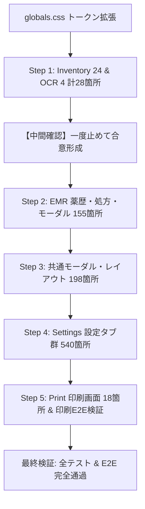

# Implementation Plan: P2-3 デザイントークン策定とインラインスタイル置換（約900箇所）

## 概要

本タスク（P2-3: 見積 5 人日）は、全画面に散在するインライン `style={{}}`（実測 939 箇所）を、体系的なデザイントークン（`--space-*` 等）およびセマンティックな Vanilla CSS クラスへ移行し、保守性・アクセシビリティ・デザイン一貫性を向上させるタスクです。
DoD マトリクスに基づき、印刷 E2E（`npm run test:e2e:print-layout`）による実描画回帰検証を必須とします。

---

## 1. 宿題事項の引き継ぎ・明記

> [!NOTE]
> **`PrintPickingFlow.test.ts` (176 assert) の暫定例外について**
> P2-2 で完全復元した `PrintPickingFlow.test.ts` は、画面配線検証（`claim_edit_guard` / `claim_lifecycle` / 電子処方箋調剤結果登録など）を保護するための「暫定例外」です。
> モック DB 実動テストへの完全昇格は、**P3（運用 CLI テスト移行 & 回帰基盤強化）** のスコープに明確に配置し、恒久例外化を防ぎます。

---

## 2. デザイントークン (`--space-*`) の段階設計

既存の 53 個の CSS 変数（カラーパレット、フォントファミリ、タイプスケール `--fs-*`、半径 `--radius-*`、シャドウ `--shadow-*`）は **一切リネーム・変更せず 100% 保持** します。

これに加え、余白・レイアウト用トークンを `src/app/globals.css` に追加定義します：

```css
/* 余白スケール (4px 基準) */
--space-0-5: 0.125rem; /* 2px */
--space-1:   0.25rem;  /* 4px */
--space-1-5: 0.375rem; /* 6px */
--space-2:   0.5rem;   /* 8px */
--space-2-5: 0.625rem; /* 10px */
--space-3:   0.75rem;  /* 12px */
--space-4:   1rem;     /* 16px */
--space-5:   1.25rem;  /* 20px */
--space-6:   1.5rem;   /* 24px */
--space-8:   2rem;     /* 32px */
--space-10:  2.5rem;   /* 40px */
```

---

## 3. インラインスタイル（939 箇所）の画面別置換順序

リスクを最小化し、実画面の挙動を段階的に検証するため、以下の画面・モジュール単位で順次進めます：



### 【重要】中間確認ポイント
**Step 1（Inventory 24 箇所 ＋ OCR 4 箇所 = 計 28 箇所）が完了した時点で必ず一度作業を停止し、中間報告を行います。** 方式や CSS クラス構造の妥当性を合意してから、以降のステップに進みます。

### 各ステップの内訳
- **Step 1（先行中間検証 / 28 箇所）**:
  - `src/app/inventory/`（`ImportMaster.tsx`: 10, `LocationMaster.tsx`: 9, `DailyCheckPanel.tsx`: 2, `InventoryRow.tsx`: 2, `inventory/page.tsx`: 1） = 24 箇所
  - `src/app/ocr/`（`ocr/page.tsx`: 3, `DrugSearchModal.tsx`: 1） = 4 箇所
- **Step 2（EMR 薬歴・処方・モーダル / 155 箇所）**:
  - `src/app/emr/components/PickingSupportModal.tsx`: 40
  - `src/app/emr/page.tsx`: 37
  - `src/app/emr/components/TracingReportModal.tsx`: 31
  - `src/app/emr/components/EmrInterventionModal.tsx`: 16
  - `src/app/emr/components/MedicationGuidanceModal.tsx`: 12
  - `src/app/emr/components/EmrInsightCards.tsx`: 8
  - `src/app/emr/components/SoapComponents.tsx`: 5
  - `src/app/emr/components/PatientBanner.tsx`: 5
  - `src/app/emr/components/DrugHistoryModal.tsx`: 1
- **Step 3（共通モーダル・レイアウト・基盤 / 198 箇所）**:
  - `src/components/TerminalSyncPanel.tsx`: 64
  - `src/components/dashboard/DailyClosingWizardModal.tsx`: 40
  - `src/components/MedicalInstitutionMasterSyncModal.tsx`: 27
  - `src/app/ClientLayout.tsx`: 26
  - `src/components/layout/LoginModal.tsx`: 15
  - `src/components/MedicalInstitutionAutoComplete.tsx`: 12
  - `src/db/DatabaseProvider.tsx`: 9
  - `src/components/DbSecurityBanner.tsx`: 4
  - `src/components/SyncStatusIndicator.tsx`: 1
- **Step 4（Settings 設定画面群 / 540 箇所）**:
  - `src/components/settings/AuditSettingsTab.tsx`: 186
  - `src/components/settings/BackupSettingsTab.tsx`: 168
  - `src/components/settings/StaffSettingsTab.tsx`: 81
  - `src/components/settings/DrugMasterSettingsTab.tsx`: 35
  - `src/components/settings/ExternalConnectorSettingsTab.tsx`: 30
  - `src/components/settings/MedicationInfoTemplateSettingsTab.tsx`: 26
  - `src/components/settings/FacilitySettingsTab.tsx`: 10
  - `src/components/settings/OfficialAuditSettingsTab.tsx`: 2
  - `src/app/settings/page.tsx`: 2
- **Step 5（Print 印刷画面 / 18 箇所 ＆ 印刷 E2E 検証）**:
  - `src/app/print/components/EmergencyRecoveryKeySheetPrint.tsx`: 15
  - `src/app/print/components/DrugInfoPrint.tsx`: 2
  - `src/app/print/[visitId]/page.tsx`: 1
  - 印刷 E2E スクリプト実行による 9 文書のレイアウト・レンダリング回帰検証

---

## 4. `src/components/ui/` コンポーネント設計

事前の一括量産は行わず、各画面の置換を進める中で**真に複数画面で共通化すべきと判明した最小限の UI プリミティブ**のみを段階作成します：
- 例: `Badge`（ステータスバッジの共通化）、`Button`（バリアント付きボタンスタイル）、`Modal`（ダイアログ外枠・ヘッダー・フッター構造）など。
- 各コンポーネントは Vanilla CSS（CSS モジュールまたは `globals.css` のクラス）でスタイリングし、TailwindCSS 等の未導入ツールは使用しません。

---

## 5. 各画面の実描画確認方針（プローブ方式 & E2E）

1. **実描画プローブ検証**:
   - 各コンポーネントが適切なクラス名を持ち、CSS 変数が正常に評価されることを検証。
2. **印刷 E2E（必須要件）**:
   - `npm run test:e2e:print-layout` を実行し、A4 調剤録・領収書・薬情・薬袋・お薬手帳シール・緊急復旧キーシートなど 9 ターゲットのスクリーンショット実寸・レンダリングエラー 0 件を確認。
3. **型チェック & 単体テスト**:
   - 各ステップごとに `npx tsc --noEmit` および `npm test`（全 1,324 件）が通過することを確認。

---

## 6. Verification Plan

### 自動テスト
```bash
# 1. 型検査
npx tsc --noEmit

# 2. 全テストスイート検証
npm test

# 3. 印刷 E2E 検証 (DoD 必須)
npm run test:e2e:print-layout

# 4. style={{ 残存件数測定 (目標: 0 または必要最小限の動的styleのみ)
find src -type f \( -name "*.tsx" -o -name "*.jsx" \) | xargs grep -c "style={{" | awk -F: '{s+=$2} END {print "Remaining style={{ count:", s}'
```
